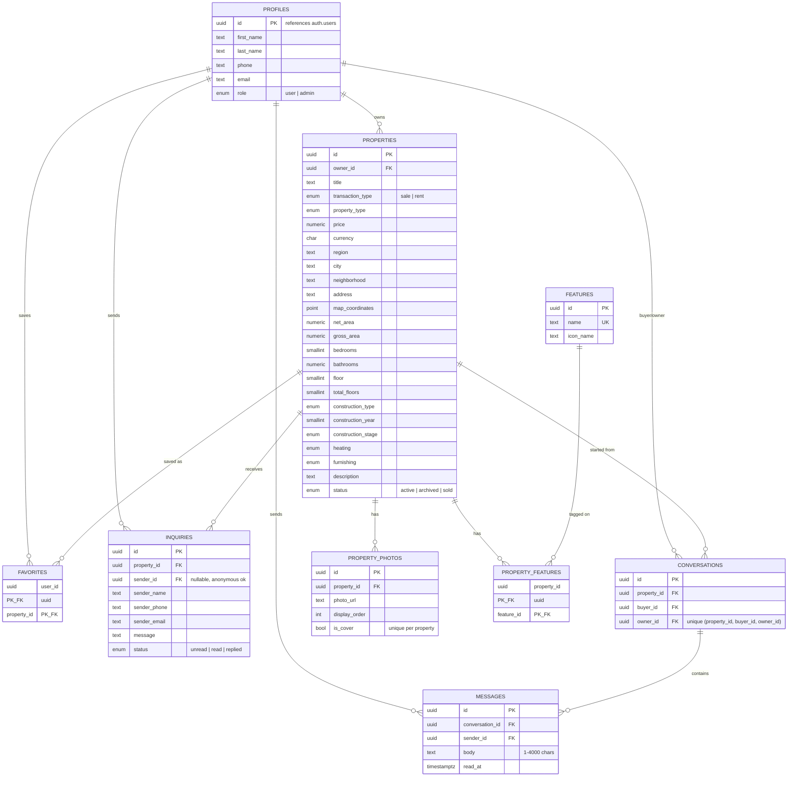

# BG Homes

A Bulgarian real-estate listings platform: visitors browse property listings, registered users list and manage their own properties, message property owners directly, and admins moderate the whole catalog from a dashboard.

## 1. Project description

BG Homes is a single-page web application for posting and browsing property listings (apartments, houses, villas, studios, offices, stores, land, garages) for sale or rent across Bulgaria.

**Who can do what:**

| Role | Capabilities |
| --- | --- |
| **Visitor** (not signed in) | Browse and filter active listings, view property details, view an owner's contact card, send an inquiry (contact form) on a listing, sign up / sign in. |
| **Registered user** | Everything a visitor can do, plus: add/edit/archive their own properties with photos and features, save favorites, message property owners in-app, manage their profile (name, phone, email, password), see inquiries and message threads for their own listings. |
| **Admin** (`profiles.role = 'admin'`) | Everything a user can do, plus: moderate/edit/delete *any* property, view site-wide inquiry stats, access the `/admin` dashboard. Admin status is granted purely via the `profiles.role` column (see `on_auth_user_created` trigger — the seed account `admin@bg-homes.local` is auto-promoted on signup). |

Key product flows: property search/filter, property detail page with photo gallery and an owner contact card, an "add property" wizard (create/edit, shared form for both), a favorites list, a per-property inquiry form (for anonymous or logged-in visitors), an in-app buyer↔owner messaging thread started from a listing, and a profile page for account management (including password reset/recovery).

## 2. Architecture

**Type:** Client-rendered SPA with a Backend-as-a-Service (Supabase) — there is no custom backend server; all data access and auth go straight from the browser to Supabase, protected by Postgres Row Level Security (RLS).

```
Browser (SPA)
   │
   │  @supabase/supabase-js (REST/PostgREST + Auth + Storage)
   ▼
Supabase project
   ├─ Postgres (schema below, RLS enforced + forced on every table)
   ├─ Auth (email/password, password recovery, hCaptcha bot protection)
   └─ Storage (public bucket `property-photos`, 1 folder per user id)
```

### Front-end

- **Vanilla JavaScript (ES modules, ES6+)** — no framework (no React/Vue/Angular, no TypeScript), per project constraints.
- **Vite** — dev server (port 5173) and production bundler (`dist/`).
- **Bootstrap 5** (utility/component classes directly in markup), compiled from Sass (`src/styles/main.scss`) with its theme variables overridden in `src/styles/_tokens.scss` to match the app's original color palette, spacing scale, radii and shadows, plus a small custom utility layer for the handful of things Bootstrap has no class for. Bespoke per-page/component CSS lives in a co-located `<name>.scss` imported by that file's `.js`.
- Each page is loaded lazily (`import()`) by a hand-rolled client-side router using the History API — no routing library.
- Pages are plain functions: `render(params, { authState })` returns an HTML string (from an `?raw`-imported `.html` template), and an optional `hydrate(root, params, { authState })` wires up event listeners after the HTML is inserted into the DOM.
- **hCaptcha** on login/registration forms, loaded globally via a `<script>` tag in `index.html` and rendered explicitly per-page (`src/lib/hcaptcha.js`) since the widget container doesn't exist until the router renders that page.
- A cookie-consent banner script (Kukie) is also loaded globally from `index.html`.

### Back-end

- **Supabase** (`@supabase/supabase-js`) provides:
  - **Auth** — email/password sign-up & sign-in, password-recovery emails, session persistence/auto-refresh in the browser.
  - **Database access** — the client talks to Postgres directly through Supabase's auto-generated PostgREST API; there is no custom API layer. All authorization is enforced by **Postgres RLS policies**, not application code.
  - **Storage** — a public `property-photos` bucket for listing photos, scoped per-user by folder (`{user_id}/...`), max 2 MB, JPEG/PNG/WEBP/GIF only.
- If `VITE_SUPABASE_URL` / `VITE_SUPABASE_ANON_KEY` are not set, `src/lib/supabase.js` exports `supabase = null` and the app falls back to static sample data (`src/data/properties.js`) with auth/data-mutation features disabled — every call site guards on `if (!supabase)`.

### Deployment

- Deployed as a static site (Netlify, see `netlify.toml`): `npm run build` → publish `dist/`, with a catch-all rewrite to `index.html` (status 200) so client-side routes resolve correctly on refresh/deep link.

## 3. Database schema design

All tables live in the `public` schema, reference Supabase's built-in `auth.users`, have RLS **enabled and forced**, and use `updated_at` triggers. Enum types (`property_type`, `transaction_type`, `construction_type`, `construction_stage`, `heating_type`, `furnishing_type`, `property_status`, `profile_role`, `inquiry_status`) constrain the relevant columns — keep frontend `<select>` options in sync with these (defined in the first migration).



**Notable design points:**

- **`profiles`** is a 1:1 extension of `auth.users`, auto-populated by the `handle_new_user()` trigger on `auth.users` insert (also copies `email` in, since `profiles` has no other way to read it under RLS). `role` is not client-updatable (column-level `revoke`); the seed email `admin@bg-homes.local` is auto-promoted to `admin` on signup.
- **`properties`** is publicly readable only when `status = 'active'`; the owner and admins can always see/manage their own regardless of status (`properties_select_public_or_owner` policy). `current_user_is_admin()` is a `security invoker`-safe SQL function used across almost every policy to avoid RLS recursion.
- **`property_photos`** enforces at most one `is_cover = true` row per property via a partial unique index, and photo files live in the Storage bucket `property-photos`, one folder per uploader (`{auth.uid()}/...`), enforced by storage policies.
- **`features`** is a shared lookup table (e.g. "elevator", "parking") joined to properties through **`property_features`** (composite PK, no surrogate key).
- **`favorites`** is a simple user↔property join table (composite PK).
- **`inquiries`** supports anonymous senders (`sender_id` nullable) submitted from the public contact form on a listing; only the property owner (or an admin, added later for dashboard stats) can read/manage them.
- **`conversations`** + **`messages`** are a later addition (in-app messaging): a buyer starts a thread from a listing (`conversations_insert_buyer` policy checks the target property is really owned by `owner_id`), both participants can read/reply, and a trigger (`touch_conversation_on_message`, `security definer`) bumps the conversation's `updated_at` on each new message so threads sort by latest activity.

## 4. Local development setup

**Prerequisites:** Node.js (for Vite 8) and a Supabase project (optional — the app runs in a degraded/read-only mode against static sample data without one).

```bash
# 1. Install dependencies
npm install

# 2. Configure environment
cp .env.example .env
# then fill in:
#   VITE_SUPABASE_URL=<your Supabase project URL>
#   VITE_SUPABASE_ANON_KEY=<your Supabase anon/public key>

# 3. Apply the database schema (if using the Supabase CLI against a linked project)
supabase db push
# — or run the files in supabase/migrations/ in order via the SQL editor

# 4. Run the dev server
npm run dev       # http://localhost:5173
```

Other scripts:

```bash
npm run build     # production build to dist/
npm run preview   # serve the production build, http://localhost:4173
```

There is no test runner or linter configured — verify changes with `npm run build` and by exercising the app in the dev server.

Without `.env` values, `supabase` is `null` and the app falls back to the static listings in `src/data/properties.js`; sign-in/sign-up, favorites, messaging, and posting properties are unavailable in that mode.

## 5. Key folders and files

```
index.html                 Entry HTML; loads hCaptcha + cookie-consent scripts and src/main.js
src/main.js                 Imports global CSS, calls bootstrapApp()
src/app.js                   bootstrapApp(): renders header/page/footer slots, wires router + auth subscription
src/router.js                 Route table (routeMatchers), auth-guarded routes, lazy page loading, history navigation
src/lib/
  supabase.js                Supabase client init; supabase = null when unconfigured
  auth.js                     Auth singleton state (user/profile/isAdmin/recoveryMode), sign in/up/out, profile updates
  properties.js               Property CRUD/query helpers against Supabase
  messages.js                 Conversation/message helpers (start thread, send, mark read)
  admin.js                    Admin dashboard data helpers (stats, moderation queries)
  photo-upload.js              Upload/delete helpers for the property-photos storage bucket
  format.js                    Shared formatting helpers (price, area, dates, enum labels)
  hcaptcha.js                  Explicit hCaptcha widget render/response/reset helpers
src/data/
  properties.js                Static sample listings (fallback when Supabase isn't configured)
  bg-locations.js               Bulgaria region/city data for location selects
src/components/
  header/                       Site nav, auth-aware menu, mobile menu (header.js + header.html)
  footer/                       Site footer (footer.js + footer.html)
  property-card/                 Reusable listing card renderer used on home/properties/favorites
src/pages/<name>/<name>.js+.html  One folder per route; each exports render() and optionally hydrate()
  home, properties, property-details, add-property (create + edit), profile, admin,
  login, register, forgot-password, reset-password, cookies, privacy, terms, not-found
src/styles/
  main.scss                    Bootstrap theme overrides + import + custom utility layer
  _tokens.scss                  Color/palette Sass variables, shared by main.scss and page-scoped scss files
supabase/migrations/            Timestamped SQL migrations — source of truth for the DB schema (see section 3)
vite.config.js                  Build tooling config (Sass support via the `sass` package)
netlify.toml                    Netlify build/publish + SPA redirect config
CLAUDE.md                        AI-assistant working agreement (hard constraints, architecture notes)
```
